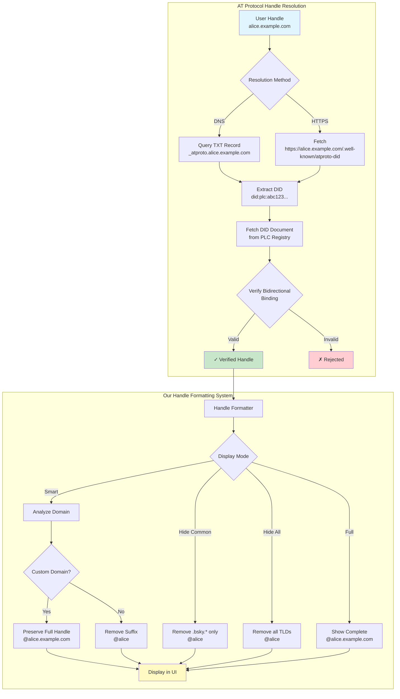
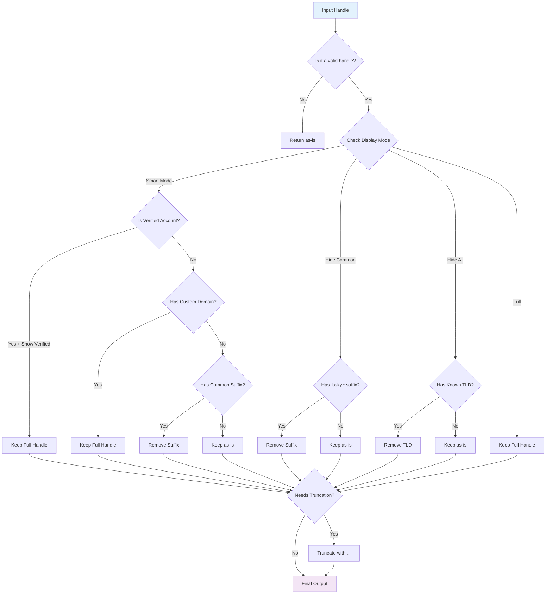

# Handle Resolution & Formatting Flow Diagram



## Handle Formatting Decision Tree



## Domain Verification Methods Comparison

| Method | DNS TXT Record | HTTPS Well-Known |
|--------|----------------|------------------|
| **Setup** | Add TXT record to DNS | Host file on web server |
| **Format** | `_atproto.handle` → `did=did:plc:xxx` | `/.well-known/atproto-did` → `did:plc:xxx` |
| **Pros** | • No web server needed<br/>• Simple for single handle<br/>• DNS provider UI | • Easy for many subdomains<br/>• Dynamic responses<br/>• No DNS access needed |
| **Cons** | • Requires DNS access<br/>• One record per handle<br/>• DNS propagation delay | • Requires web server<br/>• HTTPS certificate needed<br/>• Server maintenance |
| **Best For** | Individual users | Organizations, services |

## Handle Examples by Category

### Standard Bluesky Handles
```
alice.bsky.social     → @alice
team.bsky.team       → @team  
dev.bsky.app         → @dev
admin.bsky.network   → @admin
```

### Custom Domain Handles (Preserved)
```
news.nytimes.com     → @news.nytimes.com
support.apple.com    → @support.apple.com
blog.personal.site   → @blog.personal.site
ceo.company.io       → @ceo.company.io
```

### International Domains
```
user.co.uk          → @user.co.uk (Smart)
user.co.uk          → @user.co (Hide All)
admin.de            → @admin.de (Smart)
admin.de            → @admin (Hide All)
```

### Edge Cases
```
verylongusername.bsky.social → @verylonguserna... (Compact)
a.b.c.d.bsky.social          → @a.b.c.d
user                         → @user (no domain)
""                          → @ (empty - handled gracefully)
``` 